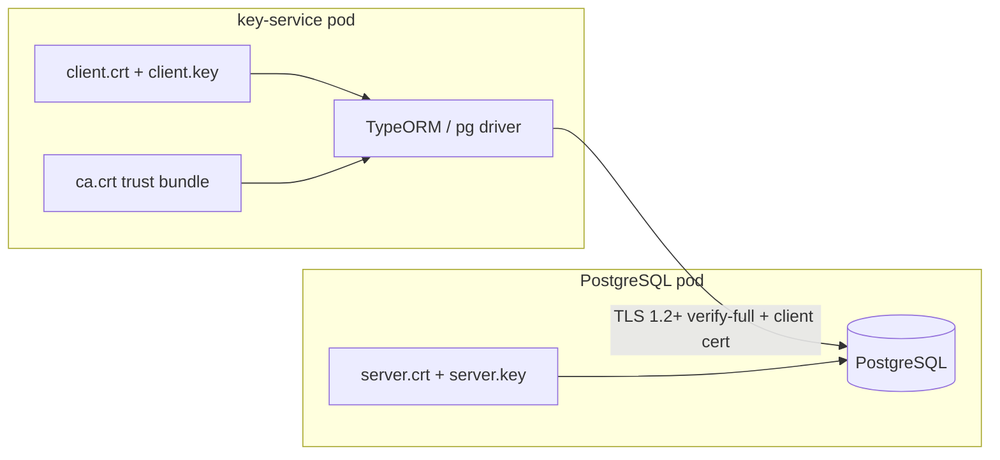

# Implementation Plan: PostgreSQL mTLS for Key Service

> **Status:** Phases 1, 2.1, 3 (standalone Helm client flags), and 4 **done** in this repo. Phases 2.2 (K8s secrets / cert-manager), umbrella Helm, and 5–7 rollout items **pending**.  
> **Audit driver:** R7-001 — DB SSL with `rejectUnauthorized: false` → **remediated in application code**  
> **Last updated:** 2026-06-18

## Goal

Enable **mutual TLS (mTLS)** between the key-service application and PostgreSQL in all deployment targets (Kubernetes/Helm, Docker Compose, local `npm run dev`), while preserving the existing **application-layer encryption** of key material at rest.

mTLS adds defense-in-depth on the database wire. It does **not** replace AES-256-GCM ciphertext storage — even with mTLS disabled, PostgreSQL holds encrypted blobs only.

## Current State

| Area | Status | Notes |
|------|--------|-------|
| **Application code** | ✅ Done | `database-ssl.config.ts` — modes, CA/client cert, production guards; R7-001 fixed |
| **Cert script** | ✅ Done | `scripts/generate-postgres-tls-certs.sh`, `npm run docker:certs` |
| **Docker Compose** | ✅ Done | mTLS enabled; postgres + key-service verified (`/health` DB up) |
| **Local `npm run dev`** | ✅ Documented | Host connects to Docker postgres on 5432 with TLS env vars (see README) |
| **Standalone Helm** | ✅ Client flags | `database.ssl.enabled=false` default; optional `mtls.enabled`; env + volume wiring in `deployment.yaml` |
| **Umbrella Helm** (`company-wallet`) | ⏳ Pending | Mirror `database.ssl` values in umbrella subchart — separate track |
| **Bitnami PostgreSQL subchart** | ⏳ Pending | `postgresql.tls.enabled=false` in values; wire server certs at rollout |
| **K8s secrets / cert-manager** | ⏳ Pending | Script prints `kubectl create secret` example |
| **CI** (`.github/workflows/ci-cd.yml`) | ✅ Exception | Plain postgres service — keep for speed |
| **Test DB** (`docker-compose.test.yml`) | ✅ Exception | Plain postgres on 5433 — unit/e2e default path |
| **Migrations CLI** | ✅ Done | Inherits TLS via `cliDbConfig` → `baseDbConfig` |
| **SECURITY_REPORT.md** | ⏳ Pending | Mark R7-001 remediated when Helm prod path ships |

### Implemented files

```
apps/app/src/config/database-ssl.config.ts       # SSL builder (new)
apps/app/src/config/database-ssl.config.spec.ts  # 15 unit tests (new)
apps/app/src/config/database.config.ts           # uses SSL builder
scripts/generate-postgres-tls-certs.sh           # cert generation (new)
scripts/ensure-signing-key.sh                    # 644 for distroless bind mounts
docker/docker-compose.yml                        # mTLS wired
docker/postgres/entrypoint.sh                    # cert permission fix for postgres user
docker/postgres/pg_hba.conf                      # hostssl + clientcert=verify-full
docker/certs/.gitignore                          # gitignore generated PKI
package.json                                     # docker:certs, docker:up chain
README.md, docker/README.md                      # mTLS workflow docs
CHANGELOG.md, .cursor/notes/security.md        # updated
```

### Still to touch (Helm / prod rollout)

```
helm/templates/deployment.yaml
helm/values.yaml
company-wallet/helm/charts/key-service/templates/key-service.yaml  # separate repo
company-wallet/helm/values.yaml
docs/SECURITY_REPORT.md
```

---

## Target Architecture



**Trust model**

1. Internal CA (per environment) signs server and client certificates.
2. PostgreSQL requires TLS (`hostssl` in `pg_hba.conf`) and validates client certificates (mTLS).
3. key-service validates server cert (`rejectUnauthorized: true`) using the same CA.
4. Password auth (`scram-sha-256`) remains alongside client certs unless moving to cert-only auth in a later hardening pass.

**Client cert CN:** When `pg_hba.conf` uses `clientcert=verify-full`, the client certificate CN **must match the DB username** (Docker Compose default: `postgres`). Set `POSTGRES_TLS_CLIENT_CN` in the cert script to match production DB users.

**Helm (production path):** Prefer cert-manager `Certificate` + `Issuer` (or cluster CA) over Bitnami `tls.autoGenerated` for rotation and auditability. Use Bitnami `tls.autoGenerated: true` only for dev/review clusters as a stepping stone.

---

## Phase 1 — Application code (key-service) ✅

Implemented in `apps/app/src/config/database-ssl.config.ts`.

| Env var | Purpose | Required when |
|---------|---------|---------------|
| `DB_SSL` | `true` / `false` | Always |
| `DB_SSL_MODE` | `disable` \| `require` \| `verify-ca` \| `verify-full` | When `DB_SSL=true`; default `verify-full` |
| `DB_SSL_CA` | Path to CA PEM | When mode is `verify-ca` or `verify-full` |
| `DB_SSL_CERT` | Path to client cert PEM | mTLS (client auth) |
| `DB_SSL_KEY` | Path to client key PEM | mTLS (client auth) |
| `DB_SSL_REJECT_UNAUTHORIZED` | `true` / `false` | Default `true`; `false` allowed **only** when `NODE_ENV≠production` |

**Do not use `DB_SSL_MODE=require` in production Helm values** — it encrypts traffic but does not authenticate the server. Production: `verify-full` + client cert paths.

### 1.1–1.3 Checklist

- [x] SSL builder with PEM loading and `ConfigurationException` on missing files
- [x] Shared between runtime and CLI (`cliDbConfig`)
- [x] Unit tests (15 cases) in `database-ssl.config.spec.ts`
- [x] Production rejects `DB_SSL_REJECT_UNAUTHORIZED=false`
- [x] TLS mode logged at startup (warn in production, info in dev)
- [x] Health checks use same TypeORM pool — no separate change needed

---

## Phase 2 — Certificate generation & secrets

### 2.1 Script ✅

`scripts/generate-postgres-tls-certs.sh` → `docker/certs/postgres/` (gitignored):

```
ca.crt, ca.key          # CA (ca.key not mounted into containers)
server.crt, server.key  # PostgreSQL server
client.crt, client.key  # key-service client (CN defaults to postgres)
```

- Idempotent; `--force` to regenerate
- SANs: `postgres`, `localhost`, `company-wallet-postgresql`, `key-store`, `key-service-postgresql`
- Validity: 825 days (`POSTGRES_TLS_DAYS` override)
- `npm run docker:certs`

**Docker Compose permission note:** `client.key` and `docker/signing-key` use mode `644` so distroless `nonroot` (uid 65532) can read bind-mounted files. Kubernetes uses secret `defaultMode` instead.

### 2.2 Kubernetes secrets ⏳

| Secret | Keys | Consumers |
|--------|------|-----------|
| `{release}-postgresql-tls` | `tls.crt`, `tls.key`, `ca.crt` | Bitnami PostgreSQL (`tls.certificatesSecret`) |
| `key-service-db-tls` | `ca.crt`, `client.crt`, `client.key` | key-service Deployment volumeMount |

---

## Phase 3 — Helm charts ✅ (client-side flags)

Standalone chart wires opt-in TLS/mTLS via `database.ssl` values (defaults preserve plain TCP):

```yaml
database:
  ssl:
    enabled: false          # DB_SSL — flip to true at rollout
    mode: verify-full
    caPath: /run/secrets/db-tls/ca.crt
    mtls:
      enabled: false        # DB_SSL_CERT/KEY — separate from TLS
      certPath: /run/secrets/db-tls/client.crt
      keyPath: /run/secrets/db-tls/client.key
    clientTlsSecretName: key-service-db-tls

postgresql:
  tls:
    enabled: false
    certificatesSecret: ""
```

`helm/templates/deployment.yaml` sets `DB_SSL*` env vars and mounts `clientTlsSecretName` when `database.ssl.enabled=true`. Mirror in company-wallet umbrella subchart separately. Server-side Bitnami TLS + cert-manager wiring remains pending.

---

## Phase 4 — Docker Compose & local dev ✅

### 4.1 `docker/docker-compose.yml` ✅

- Postgres: custom entrypoint, SSL on, `pg_hba.conf` with `clientcert=verify-full`
- key-service: `DB_SSL=true`, `DB_SSL_MODE=verify-full`, cert volume at `/run/secrets/db-tls`
- `npm run docker:up` → `docker:certs` → `docker:signing-key` → compose up

### 4.2 Company-wallet local stack ⏳

Separate repo — apply same cert layout to `key-store` when ready.

### 4.3 Local `npm run dev` ✅ (documented)

```bash
npm run docker:certs
docker compose -f docker/docker-compose.yml up -d postgres
export DB_SSL=true DB_SSL_MODE=verify-full
export DB_SSL_CA=./docker/certs/postgres/ca.crt
export DB_SSL_CERT=./docker/certs/postgres/client.crt
export DB_SSL_KEY=./docker/certs/postgres/client.key
npm run dev
```

### 4.4 Test & CI exceptions ✅

| Target | Status |
|--------|--------|
| `docker-compose.test.yml` | Plain TCP on 5433 — default for `npm run test:e2e` |
| GitHub Actions postgres | Plain TCP — keep for CI speed |
| mTLS integration | Manual verification against compose postgres on 5432 — see commands below |

**Verify mTLS locally:**

```bash
npm run docker:certs
docker compose -f docker/docker-compose.yml up -d postgres

export DB_SSL=true DB_SSL_MODE=verify-full
export DB_SSL_CA=./docker/certs/postgres/ca.crt
export DB_SSL_CERT=./docker/certs/postgres/client.crt
export DB_SSL_KEY=./docker/certs/postgres/client.key
export DB_HOST=localhost DB_PORT=5432 DB_NAME=key_service

npm run dev                    # host dev
npm run test:e2e               # e2e against mTLS (with env above)
npx tsx ./node_modules/typeorm/cli.js migration:run -d migrations/data-source.ts
```

---

## Phase 5 — Rollout strategy ⏳

1. ~~Ship code + Docker with TLS support~~ ✅
2. Enable Helm in **dev** namespace — pending
3. Enable in **review** — pending
4. Enable in **production** with cert-manager — pending

Rollback: set `database.ssl.enabled=false` and `postgresql.tls.enabled=false`; redeploy.

---

## Phase 6 — Testing checklist

- [x] Unit: SSL config builder for all `DB_SSL_MODE` values
- [x] Unit: production rejects `DB_SSL_REJECT_UNAUTHORIZED=false`
- [x] Integration: docker compose with mTLS — key-service health green, key generation over mTLS
- [x] Integration: migration CLI over mTLS (via `npx tsx ./node_modules/typeorm/cli.js migration:run -d migrations/data-source.ts`)
- [x] Integration: E2E suite connects over mTLS (TLS log confirmed; DB queries succeed). 6/24 tests pass — remaining failures are pre-existing (stale `/` route test, validation pipe not applied in e2e bootstrap, DTO field mismatches). Fixed `jest-e2e.json` ESM config so e2e runs at all.
- [x] Integration: `npm run dev` + TLS env vars → `/health` DB up, `/generate` persists key
- [x] Helm: template render with `database.ssl.enabled=true`
- [ ] Helm: fresh install dev cluster
- [ ] Negative: wrong client cert → auth failure
- [ ] Negative: untrusted CA → connection fails
- [ ] Upgrade: existing release with data PVC — TLS enable does not wipe data

---

## Phase 7 — Documentation

| Document | Status |
|----------|--------|
| `README.md` | ✅ mTLS env vars, `docker:certs`, host dev workflow |
| `docker/README.md` | ✅ TLS setup, permissions, troubleshooting |
| `.cursor/notes/deployment.md` | ✅ updated (Helm TLS details pending) |
| `.cursor/notes/security.md` | ✅ R7-001 remediated in code |
| `CHANGELOG.md` | ✅ |
| `helm/README.md` | ✅ PostgreSQL TLS subsection (opt-in feature flags) |
| `docs/SECURITY_REPORT.md` | ⏳ Mark R7-001 remediated |
| `company-wallet/*` | ⏳ separate repo |

---

## Open decisions

1. **Cert-only auth vs password + mTLS** — Using password + `clientcert=verify-full` in Docker Compose. Cert-only deferred.
2. **Bitnami autoGenerated vs cert-manager** — autoGenerated for dev; cert-manager for prod (recommended).
3. ~~**Distroless key-service image**~~ — ✅ Verified: Node `pg` driver reads mounted PEM files; bind-mount permissions handled (644 dev keys / K8s defaultMode).
4. **Umbrella vs standalone chart drift** — Implement standalone Helm first, port to umbrella subchart in company-wallet repo.

---

## Remaining effort

| Phase | Effort |
|-------|--------|
| ~~Code + tests~~ | ~~done~~ |
| ~~Cert script + Docker Compose~~ | ~~done~~ |
| Helm (standalone + umbrella) | 1–2 days |
| cert-manager prod wiring | 1 day |
| Docs + prod rollout | 0.5 day |

---

## References

- Audit: R7-001 — `rejectUnauthorized: false` in legacy `database.config.ts` (fixed)
- SSL builder: `apps/app/src/config/database-ssl.config.ts`
- Bitnami PostgreSQL TLS: https://github.com/bitnami/charts/tree/main/bitnami/postgresql#securing-traffic-using-tls
- TypeORM PostgreSQL SSL: https://typeorm.io/data-source-options#postgres--cockroachdb-data-source-options
