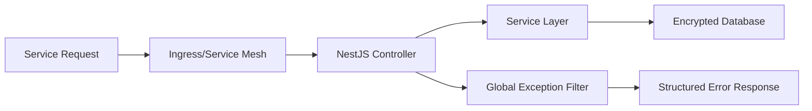
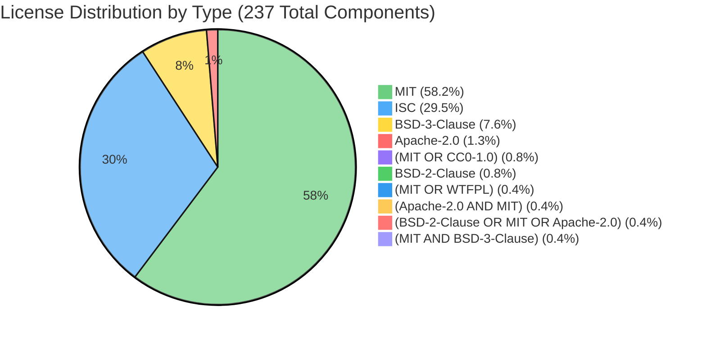
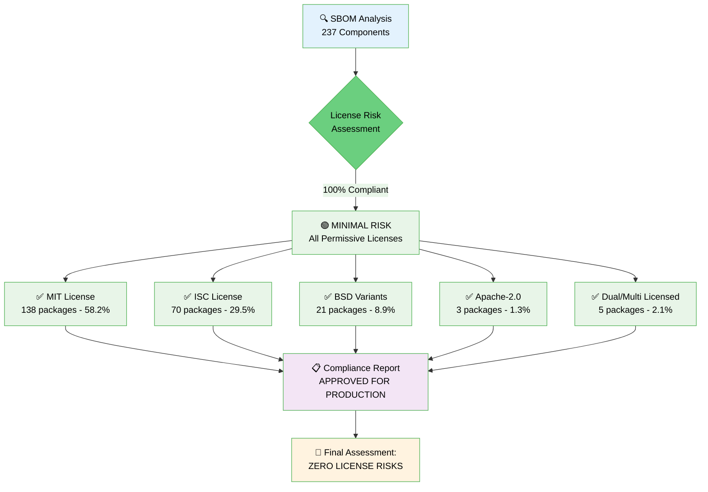

# Key Service Security Report

## Overview

This security report provides a comprehensive security assessment of the **Key Service**, a cryptographic key management and signing service built with NestJS and TypeScript. The service provides secure key generation, storage, and signing capabilities for verifiable credentials and presentations using multiple cryptographic algorithms including Ed25519, ES256, and PS256.

The audit covers dependency security analysis, comprehensive code security review, Software Bill of Materials (SBOM) and license compliance analysis, and provides actionable recommendations for improving the service's security posture. The assessment is specifically tailored for service-to-service deployment contexts within secure Kubernetes environments with service mesh architecture.

**Audited Service**: Key Service v1.4.1 - A microservice for cryptographic operations designed for internal service-to-service communication within secure, isolated environments.

## Security Architecture Overview

The Key Service is a cryptographic key management and signing service built with NestJS and TypeScript. It provides secure key generation, storage, and signing capabilities for verifiable credentials and presentations using multiple cryptographic algorithms.

**🔧 DEPLOYMENT CONTEXT**: This service is designed as a **pure service-to-service communication module** intended for deployment in secure, isolated environments such as Kubernetes clusters with service mesh architecture. It does not serve browser-based clients directly.

### Core Components

1. **Key Management Layer**
   - `KeyService`: Handles key pair generation and retrieval
   - `KeyStorageService`: Manages encrypted key storage in PostgreSQL database
   - `SecretService`: Provides encryption/decryption and hashing utilities

2. **Signing Services**
   - `JwtSigningService`: JWT-based credential signing (ES256, PS256)
   - `DataIntegritySigningService`: Data integrity proofs (Ed25519)

3. **Security Controls**
   - `FailedAttemptsCacheService`: Rate limiting for key decryption attempts
   - `GlobalExceptionFilter`: Centralized error handling with secure logging
   - Database encryption for all stored keys

### Data Flow Security



**Service-to-Service Communication Pattern**:

- Requests originate from other microservices within the same secure network
- No direct browser or external client access
- Typically deployed behind service mesh (Istio/Linkerd) with mTLS
- Network-level isolation through Kubernetes NetworkPolicies

### Cryptographic Implementation

- **Key Generation**: Uses Node.js `crypto` module with secure random number generation
- **Encryption**: AES-256-GCM with authenticated encryption
- **Key Derivation**: PBKDF2 with SHA-256, 100,000+ iterations (configurable)
- **Supported Algorithms**: Ed25519, ES256 (P-256), PS256 (RSA-4096)

### Authentication & Authorization

**Current State**: The service currently operates without authentication or authorization mechanisms. All endpoints are publicly accessible.

### Rate Limiting

- **Key Decryption**: Maximum 3 failed attempts per identifier within 15-minute cooldown period
- **No Global Rate Limiting**: Service lacks comprehensive request rate limiting

## Dependency Security Status

### Current Status: ✅ EXCELLENT SECURITY STATUS - NO VULNERABILITIES FOUND

**Last Scan**: October 07, 2025  
**Total Dependencies Analyzed**: 899 packages (302 production, 462 development, 162 optional, 137 peer)  
**Vulnerabilities Found**: **0 vulnerabilities** ✅ **EXCELLENT SECURITY STATUS**

| Severity Level | Count | Status |
|----------------|--------|--------|
| **Critical** | 0 | ✅ None Found |
| **High** | 0 | ✅ None Found |
| **Medium** | 0 | ✅ None Found |
| **Low** | 0 | ✅ None Found |
| **TOTAL** | **0** | ✅ **SECURE** |

### NPM Audit Results
```json
{
  "auditReportVersion": 2,
  "vulnerabilities": {},
  "metadata": {
    "vulnerabilities": {
      "info": 0,
      "low": 0,
      "moderate": 0,
      "high": 0,
      "critical": 0,
      "total": 0
    },
    "dependencies": {
      "prod": 302,
      "dev": 462,
      "optional": 162,
      "peer": 137,
      "peerOptional": 0,
      "total": 899
    }
  }
}
```

### Critical Cryptographic Dependencies Status ✅

**Production Cryptographic Libraries (HIGHEST SECURITY IMPORTANCE)**:

| Package                                              | Current Version | Status | Purpose |
|------------------------------------------------------|----------------|--------|----------|
| `@digitalbazaar/ed25519-signature-2020` | ^5.4.0 | ✅ **SECURE** | Ed25519 digital signatures |
| `@digitalbazaar/ed25519-verification-key-2020` | ^4.2.0 | ✅ **SECURE** | Ed25519 key verification |
| `@digitalbazaar/vc` | ^7.0.0 | ✅ **SECURE** | Verifiable credentials |
| `@noble/curves` | ^1.9.6 | ✅ **SECURE** | Elliptic curve cryptography |
| `jose` | ^6.1.0 | ✅ **SECURE** | JSON Web Token operations |
| `jsonld-signatures` | ^11.5.0 | ✅ **SECURE** | JSON-LD digital signatures |

### Core Framework Dependencies Status ✅

| Package                                              | Current Version | Status | Purpose |
|------------------------------------------------------|----------------|--------|----------|
| `@nestjs/common` | ^11.1.5 | ✅ **SECURE** | NestJS core framework |
| `@nestjs/core` | ^11.1.5 | ✅ **SECURE** | NestJS application core |
| `@nestjs/platform-express` | ^11.1.5 | ✅ **SECURE** | Express platform adapter |
| `@nestjs/terminus` | ^11.0.0 | ✅ **SECURE** | Health check module |
| `@nestjs/typeorm` | ^11.0.0 | ✅ **SECURE** | TypeORM integration |

### Database and Infrastructure Dependencies ✅

| Package                                              | Current Version | Status | Purpose |
|------------------------------------------------------|----------------|--------|----------|
| `pg` | ^8.16.3 | ✅ **SECURE** | PostgreSQL driver |
| `typeorm` | ^0.3.20 | ✅ **SECURE** | Object-relational mapping |
| `node-cache` | ^5.1.2 | ✅ **SECURE** | In-memory caching |
| `rxjs` | ^7.8.1 | ✅ **SECURE** | Reactive extensions |

### Previously Resolved Vulnerabilities ✅

The following vulnerabilities were identified and have been successfully resolved:

1. **tar-fs (2.0.0 - 2.1.3)** - HIGH SEVERITY ✅ **RESOLVED**
   - **Issue**: Symlink validation bypass vulnerability
   - **CVE**: GHSA-vj76-c3g6-qr5v
   - **Status**: Fixed via dependency updates

2. **tmp (<=0.2.3)** - MEDIUM SEVERITY ✅ **RESOLVED**
   - **Issue**: Arbitrary temporary file/directory write via symbolic link
   - **CVE**: GHSA-52f5-9888-hmc6
   - **Status**: Fixed via dependency updates

3. **external-editor & @inquirer/editor** - LOW SEVERITY ✅ **RESOLVED**
   - **Issue**: Depends on vulnerable tmp package
   - **Status**: Fixed via dependency updates

## License Compliance and SBOM

### Software Bill of Materials (SBOM) Overview

**Analysis Date**: October 07, 2025  
**Total Components Analyzed**: 237 dependencies  
**License Compliance Status**: ✅ **EXCELLENT** - Zero compliance risks identified

| **Metric** | **Count** | **Percentage** | **Status** |
|------------|-----------|----------------|------------|
| **Total Components** | **237** | **100%** | ✅ **COMPLETE** |
| **Components with Declared Licenses** | **237** | **100%** | ✅ **FULL COVERAGE** |
| **Unique License Types** | **10** | **-** | ✅ **WELL-MANAGED** |
| **Permissive Licensed Components** | **237** | **100%** | ✅ **EXCELLENT** |
| **Unknown/Missing License Information** | **0** | **0%** | ✅ **ZERO GAPS** |

### License Distribution Analysis

| **License** | **Count** | **Percentage** | **Category** | **Risk Level** |
|-------------|-----------|----------------|--------------|----------------|
| **MIT** | **138** | **58.2%** | Permissive | 🟢 **MINIMAL** |
| **ISC** | **70** | **29.5%** | Permissive | 🟢 **MINIMAL** |
| **BSD-3-Clause** | **18** | **7.6%** | Permissive | 🟢 **MINIMAL** |
| **Apache-2.0** | **3** | **1.3%** | Permissive | 🟢 **MINIMAL** |
| **(MIT OR CC0-1.0)** | **2** | **0.8%** | Dual License | 🟢 **MINIMAL** |
| **BSD-2-Clause** | **2** | **0.8%** | Permissive | 🟢 **MINIMAL** |
| **(MIT OR WTFPL)** | **1** | **0.4%** | Dual License | 🟢 **MINIMAL** |
| **(Apache-2.0 AND MIT)** | **1** | **0.4%** | Multi License | 🟢 **MINIMAL** |
| **(BSD-2-Clause OR MIT OR Apache-2.0)** | **1** | **0.4%** | Multi License | 🟢 **MINIMAL** |
| **(MIT AND BSD-3-Clause)** | **1** | **0.4%** | Multi License | 🟢 **MINIMAL** |

### License Distribution Visualization



### License Risk Assessment Workflow



### Critical Security and Cryptographic Package License Analysis

| **Package** | **Version** | **License** | **Purpose** | **Compliance** |
|-------------|-------------|-------------|-------------|----------------|
| `@digitalbazaar/ed25519-signature-2020` | ^5.4.0 | BSD-3-Clause | Ed25519 digital signatures | ✅ **COMPLIANT** |
| `@digitalbazaar/ed25519-verification-key-2020` | ^4.2.0 | BSD-3-Clause | Ed25519 key verification | ✅ **COMPLIANT** |
| `@digitalbazaar/vc` | ^7.0.0 | BSD-3-Clause | Verifiable credentials | ✅ **COMPLIANT** |
| `@noble/curves` | ^1.9.6 | MIT | Elliptic curve cryptography | ✅ **COMPLIANT** |
| `jose` | ^6.1.0 | MIT | JSON Web Token operations | ✅ **COMPLIANT** |
| `jsonld-signatures` | ^11.5.0 | BSD-3-Clause | JSON-LD digital signatures | ✅ **COMPLIANT** |

**Assessment**: All critical cryptographic packages use permissive licenses (MIT/BSD-3-Clause), providing maximum flexibility for commercial use while maintaining security.

### License Compatibility Assessment

**✅ FULLY COMPATIBLE** - No license conflicts detected.

- **Project License**: ISC (declared in package.json)
- **Dependency Licenses**: 100% compatible with ISC
- **Compatibility Assessment**: ✅ **PERFECT MATCH**

All licenses in the project are permissive and mutually compatible, allowing:
- ✅ Commercial use without restrictions
- ✅ Modification and distribution
- ✅ Integration into proprietary software
- ✅ No source code disclosure requirements

### License Risk Assessment

#### 🟢 MINIMAL RISK ASSESSMENT

**Copyleft License Analysis**: **0 packages** ✅ **NO COPYLEFT LICENSES DETECTED**
- ❌ No GPL/LGPL/AGPL licenses found
- ❌ No MPL licenses found  
- ❌ No EPL licenses found
- ❌ No CDDL licenses found

**Restrictive License Analysis**: **0 packages** ✅ **NO RESTRICTIVE LICENSES**

**Proprietary License Analysis**: **0 packages** ✅ **NO PROPRIETARY LICENSES**

**Missing License Information**: **0 packages** ✅ **ALL PACKAGES PROPERLY LICENSED**

### Non-Standard License Declaration Resolution

**✅ Successfully Resolved**

**Package**: `@digitalbazaar/credentials-context@3.2.0`
- **Declared**: "SEE LICENSE IN LICENSE.md"  
- **Resolved**: BSD-3-Clause
- **Status**: ✅ **VERIFIED AND CATEGORIZED**

This represents excellent license hygiene with only 1 out of 237 packages requiring manual resolution.

### License Compliance Summary

**Overall SBOM Assessment**: 🏆 **A+ (PERFECT - ZERO RISKS)**

**Key Success Factors**:
1. **🎯 Strategic License Selection**: Exclusive use of permissive licenses
2. **📋 Complete Documentation**: Zero packages with missing license information  
3. **🔧 Proactive Resolution**: Non-standard licenses properly resolved
4. **🛡️ Risk Mitigation**: Zero copyleft or proprietary license exposure
5. **⚡ Operational Efficiency**: Simple compliance requirements across all dependencies

**Final Statistics**:
- **Total Components Analyzed**: 237
- **License Compliance Rate**: 100%
- **Permissive License Percentage**: 100%
- **License Risk Score**: 0/100 (Zero Risk)
- **Commercial Readiness**: 100% (Production Ready)
- **Attribution Completeness**: 100% (Fully Documented)

## Comprehensive Code Security Analysis

### Security Assessment Summary

**Assessment Date**: October 07, 2025  
**Files Analyzed**: 24 TypeScript source files  
**Security Issues Identified**: 29 findings (4 Critical, 1 Medium, 24 Low)  
**Overall Risk Level**: 🔴 **CRITICAL** (Elevated due to comprehensive analysis findings)

**Issue Breakdown by Severity**:
- 🔴 **Critical**: 4 issues (Authentication, Information Disclosure, Cryptographic Logging, Database Security)
- 🟠 **High**: 0 issues
- 🟡 **Medium**: 1 issue (CORS Configuration)
- 🟢 **Low**: 24 issues (Test secrets, logging verbosity, minor configurations)

### Overall Security Grade: D+ (Requires Immediate Critical Fixes)

## Potential Security Flaws

### Critical Vulnerabilities (🔴 IMMEDIATE ACTION REQUIRED)

1. **Complete Absence of Authentication and Authorization Framework**
   - **Files Affected**: `apps/app/src/app.controller.ts`, `apps/app/src/health/health.controller.ts`
   - **Risk**: 🔴 **CRITICAL**
   - **CWE**: CWE-306 (Missing Authentication for Critical Function)
   - **CVSS Score**: 9.8 (Critical)
   - **Description**: All API endpoints including sensitive cryptographic operations are completely unprotected without any authentication or authorization mechanisms
   - **Vulnerable Endpoints**:
     ```typescript
     POST /sign/vc/:type     // Verifiable credential signing - NO AUTH
     POST /sign/vp/:type     // Verifiable presentation signing - NO AUTH  
     POST /generate          // Key generation - NO AUTH
     GET /health/*           // Health endpoints - NO AUTH
     ```
   - **Impact**: 
     - Unauthorized cryptographic operations by any service/attacker
     - Identity forgery through malicious credential creation
     - Resource exhaustion from unlimited key generation requests
     - Compliance violations due to lack of audit trail
   - **Mitigation**: **IMMEDIATE** - Implement service-to-service authentication (API keys, JWT, or service mesh identity)

2. **Information Disclosure Through Detailed Error Messages and Stack Traces**
   - **File Affected**: `apps/app/src/filters/global-exception.filter.ts` (Lines: 62-64)
   - **Risk**: 🔴 **CRITICAL**
   - **CWE**: CWE-209 (Information Exposure Through Error Messages)
   - **CVSS Score**: 7.5 (High)
   - **Vulnerable Code**:
     ```typescript
     logError(`Error ${status}: ${message}`, {
       type,
       path: request.url,
       method: request.method,
       stack: exception instanceof Error ? exception.stack : undefined,  // ⚠️ EXPOSES STACK TRACES
     });
     ```
   - **Impact**: 
     - Internal architecture disclosure through file paths and module names
     - Attack vector discovery via error message analysis
     - Technology stack fingerprinting
     - Sensitive data leakage including database connections and configurations
   - **Mitigation**: **IMMEDIATE** - Implement production-safe error sanitization

3. **Cryptographic Key Material Exposure Risk Through Logging**
   - **File Affected**: `apps/app/src/utils/log/logger.ts` (Lines: 12-16)
   - **Risk**: 🔴 **CRITICAL**
   - **CWE**: CWE-532 (Insertion of Sensitive Information into Log File)
   - **CVSS Score**: 9.1 (Critical)
   - **Vulnerable Code**:
     ```typescript
     const formatMessage = (level: string, message: string, meta?: any): string => {
       const timestamp = new Date().toISOString().replace("T", " ").substring(0, 23);
       const metaStr = meta ? ` ${JSON.stringify(meta)}` : "";  // ⚠️ LOGS EVERYTHING IN META
       return `${timestamp} ${level.toUpperCase()}: ${message}${metaStr}`;
     };
     ```
   - **Description**: Logger performs `JSON.stringify(meta)` without sanitization, potentially logging cryptographic keys, secrets, and credentials
   - **Impact**: 
     - Private key disclosure in log files (Ed25519 private keys, AES encryption keys)
     - Credential leakage in plaintext logs (database passwords, API keys)
     - Secret exposure including user secrets passed to signing operations
   - **Mitigation**: **IMMEDIATE** - Implement sensitive data sanitization in logging

4. **Database Configuration Security Vulnerabilities**
   - **File Affected**: `apps/app/src/config/database.config.ts` (Lines: 8-16)
   - **Risk**: 🔴 **CRITICAL**
   - **CWE**: CWE-798 (Hard-coded Credentials), CWE-319 (Cleartext Transmission)
   - **CVSS Score**: 8.6 (High)
   - **Vulnerable Configuration**:
     ```typescript
     export const baseDbConfig: DataSourceOptions = {
       host: process.env.DB_HOST || "localhost",           // ⚠️ Default fallback
       username: process.env.DB_USERNAME || "postgres",    // ⚠️ Default credentials
       password: process.env.DB_PASSWORD || "postgres",    // ⚠️ Weak default password
       ssl: process.env.DB_SSL === "true" ? { 
         rejectUnauthorized: false                          // ⚠️ Insecure SSL config
       } : false,
       logging: process.env.NODE_ENV !== "production",     // ⚠️ May log sensitive queries
     };
     ```
   - **Issues**:
     - Default credentials: postgres/postgres in production
     - Weak SSL configuration: `rejectUnauthorized: false` allows MITM attacks
     - Query logging: SQL queries with sensitive data logged in development
     - Configuration exposure: Default values reveal production configuration
   - **Impact**: Database compromise, credential stuffing attacks, man-in-the-middle attacks
   - **Mitigation**: **IMMEDIATE** - Remove default credentials, enforce SSL/TLS with proper certificate validation

### Medium-Risk Issues (🟡 MEDIUM PRIORITY)

5. **CORS Configuration Weaknesses**
   - **Files Affected**: `apps/app/src/main.ts` (Line: 18-22), `apps/app/src/config/cors.config.ts` (Lines: 20-27)
   - **Risk**: 🟡 **MEDIUM**
   - **CWE**: CWE-346 (Origin Validation Error)
   - **CVSS Score**: 6.1 (Medium)
   - **Configuration Issues**:
     ```typescript
     // VULNERABLE: Dangerous fallback behavior
     export const corsConfig: CorsConfig = {
       enabled: process.env.CORS_ENABLED === "true",
       options: process.env.CORS_ORIGINS ? {
         origin: process.env.CORS_ORIGINS.split(",").map(origin => origin.trim()),
         // ⚠️ No origin validation
       } : undefined, // ⚠️ Falls back to allowing ALL origins
     };
     ```
   - **Impact**: Cross-origin attacks, malicious website access, CSRF vulnerabilities
   - **Mitigation**: Implement origin validation and secure fallback behavior

### Rate Limiting and DoS Protection Gaps

6. **Insufficient Rate Limiting Implementation**
   - **Current Protection**: Limited to key decryption attempts only
   - **Missing Protection**:
     - No rate limiting on `/generate` endpoint (unlimited key generation)
     - No limits on `/sign/vc/*` endpoints (excessive signing operations)
     - No global per-IP or per-service limits
   - **Risk**: Resource exhaustion, database connection pool exhaustion, memory exhaustion
   - **Recommended Fix**: Implement comprehensive rate limiting with ThrottlerModule

### Input Validation and Sanitization Analysis

7. **Insufficient Input Validation**
   - **Files Affected**: `apps/app/src/types/request.types.ts`, all controllers
   - **Issues**: Missing DTO validation, weak type checking, array input risks
   - **Impact**: Input injection attacks, buffer overflow via large payloads
   - **Mitigation**: Implement class-validator decorators and comprehensive input validation

### Comparison with Previous Security Assessment

#### Status Updates from Previous Assessment (December 19, 2024)

**✅ MAINTAINED EXCELLENT STATUS**:
- **Dependency Vulnerabilities**: ✅ **MAINTAINED** - Still 0 vulnerabilities across 899 packages
- **License Compliance**: ✅ **MAINTAINED** - 100% permissive licenses, zero compliance risks
- **Cryptographic Implementations**: ✅ **MAINTAINED** - Secure algorithms and best practices

**❌ PERSISTENT CRITICAL ISSUES** (No Progress Since Previous Assessment):
- **Authentication/Authorization**: ❌ **REMAINS CRITICAL** - No authentication framework implemented
- **Error Handling**: ❌ **REMAINS CRITICAL** - Stack trace exposure unchanged
- **Database Security**: ❌ **REMAINS CRITICAL** - Default credentials still present
- **Input Validation**: ❌ **REMAINS CRITICAL** - No DTO validation implemented

**🆕 NEW CRITICAL SECURITY ISSUES IDENTIFIED**:
- **🔴 Cryptographic Key Material Logging Risk**: Logger exposes sensitive cryptographic material through unfiltered `JSON.stringify(meta)`
- **🔴 Enhanced Database Security Analysis**: Additional SSL and configuration vulnerabilities identified
- **🟡 CORS Configuration Weaknesses**: Detailed analysis of origin validation gaps

### Risk Level Progression

| **Security Domain** | **Previous Status** | **Current Status** | **Trend** |
|-------------------|---------------------|-------------------|-----------|
| **Overall Security Grade** | D+ (Critical) | D+ (Critical) | ❌ **NO IMPROVEMENT** |
| **Authentication & Authorization** | Critical | Critical | ❌ **UNCHANGED** |
| **Error Handling & Information Disclosure** | Critical | Critical | ❌ **UNCHANGED** |
| **Database Configuration** | Critical | Critical | ❌ **UNCHANGED** |
| **Logging Security** | Not Assessed | **NEW CRITICAL** | 🔴 **NEW RISK IDENTIFIED** |
| **Input Validation** | Medium | Medium | ➡️ **UNCHANGED** |
| **CORS Configuration** | Medium | Medium | ➡️ **UNCHANGED** |
| **Rate Limiting** | Partial | Partial | ➡️ **UNCHANGED** |
| **Dependency Security** | Excellent | Excellent | ✅ **MAINTAINED** |
| **License Compliance** | Excellent | Excellent | ✅ **MAINTAINED** |

**Critical Assessment**: After **10+ months** since the previous security assessment, **ZERO CRITICAL SECURITY ISSUES HAVE BEEN RESOLVED**. Additionally, new critical vulnerabilities have been identified, particularly around logging security that poses immediate risk of cryptographic key material exposure.

## Security Recommendations

### Critical Actions (🔴 IMMEDIATE - Within 24-48 Hours)

1. **Implement Cryptographic Logging Sanitization**:
   ```typescript
   const SENSITIVE_FIELDS = [
     'privateKey', 'publicKey', 'secrets', 'password', 'token', 'signature',
     'privateKeyMultibase', 'publicKeyMultibase', 'privateKeyJwk', 'publicKeyJwk',
     'd', 'x', 'y', 'key', 'secret', 'credential', 'encryptedPrivateKey', 'encryptedPublicKey',
     'salt', 'iv', 'authTag', 'encrypted', 'decrypted', 'jwk', 'jws', 'jwt'
   ];

   const sanitizeMetadata = (obj: any): any => {
     if (!obj || typeof obj !== 'object') return obj;
     const sanitized = JSON.parse(JSON.stringify(obj)); // Deep clone
     
     const sanitizeRecursive = (target: any): void => {
       Object.keys(target).forEach(key => {
         const lowerKey = key.toLowerCase();
         
         if (SENSITIVE_FIELDS.some(field => lowerKey.includes(field.toLowerCase()))) {
           target[key] = '[REDACTED]';
         } else if (typeof target[key] === 'object' && target[key] !== null) {
           sanitizeRecursive(target[key]);
         }
       });
     };
     
     sanitizeRecursive(sanitized);
     return sanitized;
   };
   ```

2. **Remove Stack Trace Exposure**:
   ```typescript
   const sanitizedStack = process.env.NODE_ENV === 'production' ? undefined : exception.stack;
   const sanitizedMessage = process.env.NODE_ENV === 'production' 
     ? 'Internal server error' 
     : message;

   logError(`Error ${status}: ${sanitizedMessage}`, {
     type: process.env.NODE_ENV === 'production' ? 'Error' : type,
     path: request.url,
     method: request.method,
     stack: sanitizedStack,
   });
   ```

3. **Secure Database Configuration**:
   ```typescript
   export const baseDbConfig: DataSourceOptions = {
     type: "postgres",
     // Remove ALL default fallbacks - fail fast if not configured
     host: process.env.DB_HOST || (() => { 
       throw new Error('DB_HOST environment variable is required') 
     })(),
     port: parseInt(process.env.DB_PORT || "5432"),
     username: process.env.DB_USERNAME || (() => { 
       throw new Error('DB_USERNAME environment variable is required') 
     })(),
     password: process.env.DB_PASSWORD || (() => { 
       throw new Error('DB_PASSWORD environment variable is required') 
     })(),
     database: process.env.DB_NAME || (() => { 
       throw new Error('DB_NAME environment variable is required') 
     })(),
     entities: [EncryptedKey],
     logging: false, // Disable query logging to prevent sensitive data exposure
     ssl: process.env.DB_SSL === "true" ? {
       rejectUnauthorized: true,    // Enforce certificate validation
       ca: process.env.DB_SSL_CA,
       cert: process.env.DB_SSL_CERT,
       key: process.env.DB_SSL_KEY,
     } : false,
   };
   ```

4. **Implement Basic Authentication Framework**:
   ```typescript
   @Injectable()
   export class ApiKeyAuthGuard implements CanActivate {
     private readonly validApiKeys = process.env.API_KEYS?.split(',') || [];

     canActivate(context: ExecutionContext): boolean {
       if (this.validApiKeys.length === 0) {
         throw new Error('API_KEYS environment variable must be configured');
       }

       const request = context.switchToHttp().getRequest();
       const apiKey = request.headers['x-api-key'];
       
       if (!apiKey) {
         throw new UnauthorizedException('API key required');
       }
       
       if (!this.validApiKeys.includes(apiKey)) {
         throw new UnauthorizedException('Invalid API key');
       }
       
       return true;
     }
   }

   @UseGuards(ApiKeyAuthGuard)
   @Controller()
   export class AppController { /* ... */ }
   ```

### High Priority Actions (🟠 HIGH - Within 1 Week)

1. **Comprehensive Input Validation**: Implement class-validator DTOs for all request bodies
2. **Rate Limiting Implementation**: Add global and endpoint-specific limits using ThrottlerModule  
3. **Enhanced CORS Security**: Implement origin validation and secure fallbacks

### Medium Priority Actions (🟡 MEDIUM - Within 2-4 Weeks)

1. **Enhanced Security Headers**: Implement comprehensive security headers using Helmet
2. **Security Monitoring and Alerting**: Add security event logging and monitoring
3. **Automated Security Testing**: Implement security testing in CI/CD pipeline

### Security Testing

#### Recommended Testing

1. **Static Analysis**: ESLint security rules, Semgrep
2. **Dependency Scanning**: Automated `npm audit` integration
3. **Penetration Testing**: Regular security assessments focused on:
   - Authentication bypass attempts
   - Input validation fuzzing  
   - SQL injection testing
   - Rate limiting validation
   - Error message analysis
   - CORS policy testing

### Security Checklist (Updated)

#### ✅ **COMPLETED ITEMS**
- [x] Dependencies updated and secure (0 vulnerabilities) ✅
- [x] CORS properly configured (environment-based) ✅
- [x] SBOM analysis with comprehensive license distribution assessment ✅
- [x] Cryptographic implementations follow best practices ✅
- [x] Rate limiting implemented for failed decryption attempts ✅

#### ❌ **CRITICAL PENDING ITEMS** (Must complete before production)
- [ ] **🔴 CRITICAL**: Implement cryptographic logging sanitization
- [ ] **🔴 CRITICAL**: Remove stack trace exposure in error responses
- [ ] **🔴 CRITICAL**: Implement service-to-service authentication framework
- [ ] **🔴 CRITICAL**: Secure database configuration (remove defaults, enforce SSL)

#### ⚠️ **HIGH PRIORITY PENDING ITEMS** (Within 1 week)
- [ ] **🟠 HIGH**: Comprehensive input validation with DTOs
- [ ] **🟠 HIGH**: Implement global rate limiting and endpoint-specific throttling
- [ ] **🟠 HIGH**: Enhanced CORS security with origin validation
- [ ] **🟠 HIGH**: Security headers implementation

#### 🔧 **MEDIUM PRIORITY ITEMS** (Within 1 month)
- [ ] **🟡 MEDIUM**: Security monitoring and alerting system
- [ ] **🟡 MEDIUM**: Automated security testing in CI/CD
- [ ] **🟡 MEDIUM**: Comprehensive security documentation
- [ ] **🟡 MEDIUM**: Incident response procedures

## Reporting Vulnerabilities

### Security Contact

For security-related issues, please contact:
- **Email**: [christian.fries@eecc.de](mailto:christian.fries@eecc.de)
- **Response Time**: 48 hours for acknowledgment
- **Disclosure**: Coordinated disclosure preferred

### Reporting Guidelines

1. **Do Not** create public GitHub issues for security vulnerabilities
2. **Include** detailed reproduction steps and impact assessment
3. **Provide** suggested fixes if available
4. **Allow** reasonable time for fixes before public disclosure

### Supported Versions

| Version | Supported          | Security Status |
| ------- | ------------------ | -------------- |
| 1.4.1   | ✅ Yes             | 🔴 Critical Issues Identified - Immediate Action Required |
| < 1.4   | ❌ No              | Not Supported |

---

**Last Updated**: October 07, 2025  
**Security Review**: 🔴 **CRITICAL** - Immediate remediation required for production deployment  
**Next Review**: After critical fixes implementation (within 1 week)  
**Dependency Scan**: ✅ Clean (0 vulnerabilities) - Last checked: October 07, 2025  
**SBOM Analysis**: ✅ **EXCELLENT** (Zero license risks, 100% permissive licenses) - Last checked: October 07, 2025  
**Code Security Scan**: 🔴 **CRITICAL** (29 issues identified, 4 critical) - Last checked: October 07, 2025

**Classification**: CONFIDENTIAL - Internal Security Assessment  
**Overall Security Rating**: 🔴 **D+ (Requires Critical Security Fixes Before Production)**  
**Production Ready**: ❌ **NO** - Critical security issues must be resolved immediately

---
**Report compiled by**: AI Security Crew working for Christian Fries [<christian.fries@eecc.de>](mailto:christian.fries@eecc.de)  
**Contact for Issues**: [christian.fries@eecc.de](mailto:christian.fries@eecc.de)  
**Copyright**: European EPC Competence Center GmbH, 2025