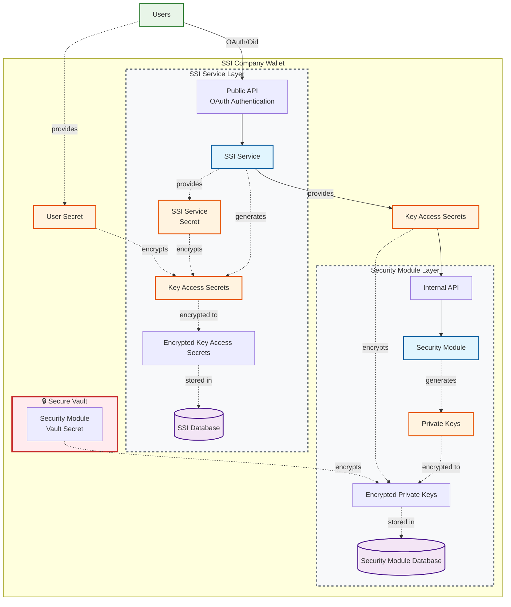

---
title: "SSI Company Wallet"
subtitle: "Security and Key Management Konzept"
author:
  - Christian Fries [<christian.fries@eecc.de>](mailto:christian.fries@eecc.de)
  - Dr. Sebastian Schmittner [<sebastian.schmittner@eecc.de>](mailto:sebastian.schmittner@eecc.de)
abstract: |
  In this paper we analyze potential security threads to the SSI Company Wallet and lay out a key management concept and service architecture to minimize the security risks. The company wallet is already set to handle all GS1 specific credentials
thanks: |
  Copyright 2025, European EPC Competence Center GmbH
hyperrefoptions:
  - linktoc=all
papersize: a4
colorlinks: true
toc: true
numbersections: true
geometry: margin=1in
fontsize: 11pt
documentclass: article
header-includes:
  - \usepackage{newunicodechar}
  - \newunicodechar{🔒}{\textcolor{red}{\textbf{LOCK}}}
  - \newunicodechar{✅}{\textcolor{green}{\textbf{✓}}}
  - \newunicodechar{⚠}{\textcolor{orange}{\textbf{!}}}
  - \usepackage{fontspec}
  - \setmainfont{DejaVu Sans}
...

# Comprehensive Functionality Overview

The SSI Company Wallet is a comprehensive self-sovereign identity solution implementing enterprise-grade security features with multi-organizational support. The system provides the following core functionalities:

## Distributed Identifiers (DIDs) Management

### DID Creation and Management

- **DID Web Creation**: Generate did:web identifiers with domain validation ensuring DIDs match company domains
- **DID Key Support**: Create did:key identifiers for ephemeral use cases
- **DID Document Generation**: Automatic creation of W3C compliant DID documents with verification methods
- **Key Addition to DIDs**: Add multiple cryptographic keys to existing DIDs with proper verification method updates
- **DID Resolution**: Resolve DIDs to their corresponding DID documents
- **Domain Validation**: Strict validation ensuring did:web domains match authenticated company domains

### Key Purpose Management

- **Authentication Keys**: Keys for DID authentication mechanisms
- **Assertion Keys**: Keys for credential issuance and verification
- **Key Agreement**: Keys for secure communication protocols
- **Capability Delegation**: Keys for delegating specific capabilities
- **Capability Invocation**: Keys for invoking specific operations

## Comprehensive Key Management Architecture

### Secure Key Generation

- **High-Entropy Generation**: 256-bit entropy using SecureRandom for maximum security
- **External Security Module**: Integration with external secure key management API for hardware-level security
- **Multi-Algorithm Support**: Ed25519 and ES256 signature algorithms
- **Key Format Support**: JWK and VerificationKey2020 formats

### Multi-Layer Key Security

- **Triple Encryption Model**: Keys encrypted with service secret + key access secret + user secrets
- **Physical Secret Separation**: Secrets distributed across different security domains
- **Memory Security**: Secure clearing of sensitive data from memory after use
- **Zero-Knowledge Architecture**: Private keys never leave the security module in decrypted form

### Multi-Signature Authorization

- **Multiple Controller Support**: Keys can be controlled by multiple users simultaneously
- **Threshold Secret Sharing**: Operations require secrets from all designated controllers
- **Controller Validation**: Strict validation ensuring all controllers provide valid secrets before operations
- **Individual Secret Management**: Each controller maintains their own encrypted secret for shared keys

## Advanced Credential Issuance

### Credential Creation and Signing

- **VC Data Model 2.0 Compliance**: Full support for W3C Verifiable Credentials Data Model 2.0
- **Multiple Signature Types**: Support for Data Integrity proofs, JWT-VC, and (SD-JWT formats)
- **Multi-Controller Signing**: Credentials can be signed using keys controlled by multiple users

### Credential Types and Schema

- **Generic Verifiable Credentials**: Support for any W3C compliant credential type
- **Custom Schema Support**: Flexible schema validation and credential structure
- **Credential Chaining**: Support for credential chains and hierarchical trust relationships
- **Extension Support**: Extensible model allowing custom properties and metadata

### Credential Publishing and Registry

- **Public Registry**: Built-in registry for public credential and DID document resolution
- **Selective Visibility**: Credentials can be marked as public or private
- **REST API Access**: Public registry accessible via RESTful endpoints
- **Multi Format Delivery**: Credentials can be deliverd as data integrity and jwt-vc
- **Company-Specific Registries**: Support for company-owned credential registries

## Sophisticated Status Management (Revocation & Suspension)

### BitString Status Lists

- **W3C Status List Compliance**: Implementation of W3C StatusList2021 using compressed bitstrings
- **Dual Status Purposes**: Support for both revocation and suspension status tracking
- **Sparse Index Management**: Efficient management of status indexes with configurable sparsity on randomized bitstring
- **Automatic Status Credential Generation**: Automatic creation of status list credentials

## Advanced Secret Management and Transfer

### Multi-User Secret Architecture

- **Individual User Secrets**: Each user maintains their own encryption secrets
- **Encrypted Secret Storage**: All secrets encrypted using AES-GCM with PBKDF2 key derivation
- **Secret Sharing Protocols**: Secure distribution of secrets among multiple controllers
- **Secret Transfer Mechanisms**: Secure protocols for transferring secret access between users
- **Company + DID secrets**: Optional comapny and DID wide secrets

### Encryption and Security

- **AES-GCM Encryption**: Industry-standard authenticated encryption
- **PBKDF2 Key Derivation**: 100,000 iterations for protection against rainbow table attacks
- **Salt-Based Security**: Unique salts for each encryption operation
- **Timing Attack Prevention**: Secure implementation preventing side-channel attacks

## GS1-Specific Credential Ecosystem

### GS1 Prefix License Credentials

- **GS1 Prefix License Support**: Native support for GS1 prefix license credentials
- **GS1 Organization Model**: Specialized model for GS1 organizations with GLN support
- **GS1 Context Integration**: Proper JSON-LD context integration for GS1 credential types
- **Credential Schema Validation**: Automatic validation against GS1 credential schemas

### GS1 Standards Compliance

- **Global Location Numbers (GLN)**: Full support for GS1 GLN identifiers
- **GS1 Digital Licenses**: Implementation of GS1 digital license framework
- **Organization Hierarchies**: Support for complex GS1 organizational structures
- **Prefix License Chains**: Support for hierarchical prefix license relationships

## Multi-Purpose Wallet for Enterprise Organizations

### Organization Type Support

- **Global Offices**: Support for multinational organizations with global operations
- **Member Organizations (MOs)**: Specialized features for member-based organizations
- **Member Companies**: Support for individual member companies within larger ecosystems

### Enterprise Features

- **Domain-Based Authentication**: OAuth/OIDC integration with domain-specific user management
- **Role-Based Access Control**: Flexible permission system matching organizational roles
- **Company Registry Integration**: Support for company-specific credential registries

## Security-First Design Principles

### Defense in Depth

- **Layered Security**: Multiple independent security layers prevent single points of failure
- **Principle of Least Privilege**: Minimal access rights for all system components
- **Secure by Default**: All features designed with security as the primary consideration
- **Comprehensive Validation**: Input validation and sanitization at all system boundaries

### Standards Compliance

- **W3C DID Core**: Full compliance with W3C DID Core specification
- **W3C VC Data Model 2.0**: Complete implementation of VC Data Model 2.0
- **GS1 Credential Chaining**: Implementation follows industry best practices and security standards

# Choice of Standards

Among the many standards that exist to implement the above functionality, we support

## DID Methods

- **did:web**
  - Must be used for public issuer DIDs
  - May be used for public holder DIDs
- **did:key**
  - May be used for private holder DIDs
- **did:webvh** (to be added)
  - Increases transparency and security around DID document updates
  - Enables pre-rotating keys

## Verifiable Credentials

- VC Data model V2

## Signature Formats

- Embedded Data Integrity proofs
- JWT-VC
- (SD-JWT)

## Cryptographic Key Types

- Ed25519
- ES256

## Exchange Protocols

- REST API
- OpenID for VC Issuance flow
- OpenID for VP Presentation flow

# Security Considerations / Threads

In a system that handels private keys which are used to authenticate the identity of companies, great care is in order to secure any access to such keys. The purpouse of the wallet is void if an attacker can get access to the private key and impersonate the company.

Our system is build to be safe from the following attacks

- A malicious attacker gets access to the wallets database
- An attacker gets access to a legitimate users IDP Account (OAuth Access Token)
- An adversary is able to access the user's or key secrets

The system is build such that private keys never leave an encapsulated security module and only exist in decrypted form in the moment they must be used. This is an isolated system component without public facing interfaces. It might be exchanged for a hardware security module or otherwise be deployed in a secure computing environment in the future. For now this is implemented as an isolated service with its own database.  
The other part of the concept is that private keys cannot be used without the separate secrets (user, key, vault secret) which are physically separated. Even in case that an adversary is able to get hands on two of these secrets he will not be able to obtain or use the private keys. The default number of secrets is two (key + vault secret) with the option to add an arbitrary number of user controlled key secrets which can be shared or individual.

# Service Architecture Overview

## Architecture Summary

### SSI Service

- Has a public API
- Connects to its own database
  - where it stores encrypted `Key Access Secrets`

### User Authentication

- Users connect to the `SSI Service`'s API
  - Authentication via OAuth/Oid
  - Can manage their own key access secrets
  - Users may or may not have the access secrets to certain DIDs or keys within a did
  - General role based access model mathcing OAuth/Oid roles

### Security Module

- Offers an internal API
- Connects to its own database
  - where it stores encrypted `Private Keys`
  - is unable to decrypt private keys by itself

### Service Communication

- The `SSI Service` is connected to the `Security Module` via the internal API

### Private Key Security

- Private Keys can only be used with at least 2 separate secrets
  - A `Security Module` specific `Security Module Client Secret`
  - The private key specific `Key Access Secret`
  - optional additional key secrets
    - an arbitrary number of different key secrets what allows mulit user confirmation for key operations

### Key Access Secret Encryption

- The `Key Access Secrets` are encrypted with
  - A `SSI Service` specific `SSI Service Client Secret`
  - An optional user specific `User Secret` to encrypt the key secrets
  - Multiple encrypted versions of the same `Key Access Secrets` may be stored, encrypted with different `User Secrets` for each user who has acces to this key

# Perspective

## Threat Model: Complete Network Traffic Compromise

In scenarios where an attacker gains complete control over network traffic (man-in-the-middle attacks, compromised network infrastructure, or state-level surveillance), traditional symmetric key-based (password) authentication becomes vulnerable. An attacker could intercept and replay the `Key Access Secrets`.

## Protection Strategy: Challenge-Response with Verifiable Presentations

The system implements a challenge-response protocol where users sign verifiable presentations containing their user secrets instead of transmitting just a password directly. This approach leverages the cryptographic strength of asymmetric signatures and the verifiable credentials framework to ensure authentication integrity even under complete network compromise.

## Ecosystem Integration

EECC provides a personal SSI Wallet that complements the company wallet architecture, creating a comprehensive self-sovereign identity ecosystem for both individual and organizational use cases.
